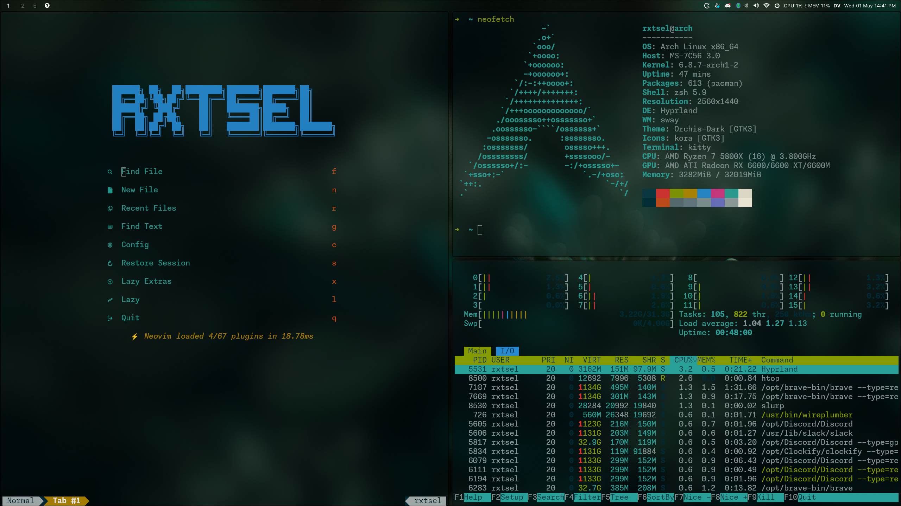
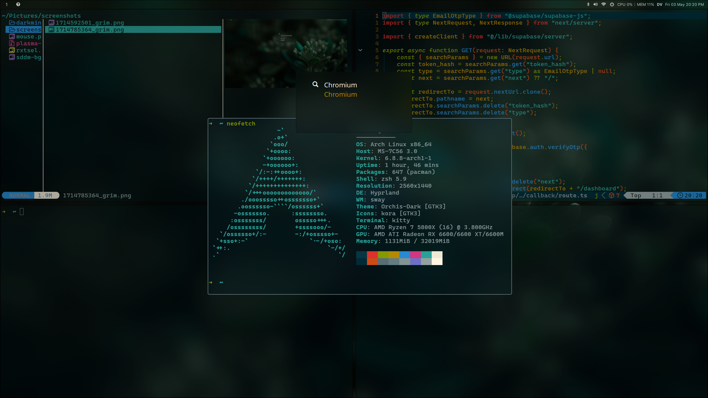

# After [minimal Arch linux setup](https://www.rxtsel.dev/en/blog/how-to-install-arch-linux-using-the-command-line/), then:

My setup for Arch Linux with Hyprland, Waybar, Kitty, and other tools. This setup is for a desktop environment, but it can be adapted to a laptop. This setup is based on **solarized-dark** colors.

## Gallery



<details>
  <summary>Click here for more photos</summary>

|                                                           |                                                       |
| --------------------------------------------------------- | ----------------------------------------------------- |
|  |  |

</details>

## 1. Yay

Replace `<username>` with your username.

```bash
sudo pacman -S base-devel git &&
cd /opt/ &&
sudo git clone https://aur.archlinux.org/yay-git.git &&
sudo chown -R <username>:<username> yay-git/ &&
cd yay-git &&
makepkg -si
```

## 2. Install dependencies

1. Pacman packages:

```bash
sudo pacman -S neovim kitty neofetch chromium yazi ntfs-3g glib2 gvfs pipewire wireplumber polkit-kde-agent qt5-wayland qt5-wayland grim slurp mpv tofi thunar waybar ark ttf-fira-sans ttf-fira-code ttf-firacode-nerd bluez bluez-utils ripgrep xsel wl-clipboard pavucontrol unzip discord spotify-launcher zsh swaync greetd-tuigreet
```

2. AUR packages:

```bash
yay -S swww ffmpegthumbnailer xdg-desktop-portal-hyprland-git gammastep wlr-randr lightdm-git
```

3. Add background image:

```bash
swww img ~/dot/wallpapers/default.png --no-resize
```

## 3. Oh-my-zsh

```bash
sh -c "$(curl -fsSL https://raw.githubusercontent.com/ohmyzsh/ohmyzsh/master/tools/install.sh)" &&
sudo chsh -s $(which zsh) &&
git clone https://github.com/zsh-users/zsh-syntax-highlighting.git ${ZSH_CUSTOM:-~/.oh-my-zsh/custom}/plugins/zsh-syntax-highlighting &&
git clone https://github.com/zsh-users/zsh-autosuggestions ${ZSH_CUSTOM:-~/.oh-my-zsh/custom}/plugins/zsh-autosuggestions
```

- _Reboot compositor._

## 4. Fonts

1. For emoji support, install the following fonts:

```bash
sudo pacman -S noto-fonts noto-fonts-cjk noto-fonts-emoji ttf-dejavu ttf-liberation ttf-font-awesome ttf-bitstream-vera gnu-free-fonts ttf-croscore ttf-droid ttf-ibm-plex ttf-liberation
```

2. Custom fonts for waybar, kitty, etc:

```bash
cd ~/Downloads/ &&
wget https://github.com/ryanoasis/nerd-fonts/releases/download/v3.0.2/CascadiaCode.zip &&
sudo unzip CascadiaCode.zip -d /usr/share/fonts/CascadiaCode &&
wget https://github.com/sahibjotsaggu/San-Francisco-Pro-Fonts/archive/refs/heads/master.zip &&
unzip master.zip -d /usr/share/fonts/SanFranciscoPro -d /usr/share/fonts/SanFranciscoPro &&
fc-cache -f -v
```

## 5. Utils for development (optional)

1. Install [fnm](https://github.com/Schniz/fnm) a node version manager:

```bash
curl -fsSL https://fnm.vercel.app/install | zsh &&
export PATH="/home/rxtsel/.local/share/fnm:$PATH"
  eval "`fnm env`"
```

2. Install a node version:

```bash
# list node versions remote
fnm list-remote

# install node version
fnm install <your_version>
```

3. Install package manager:

```bash
npm i -g @antfu/ni
```

4. Install `cz-cli` globally:

```bash
npm install -g commitizen cz-conventional-changelog && echo '{ "path": "cz-conventional-changelog" }' > ~/.czrc
```

## 6. Display manager (optional)

Enable greetd service:

```bash
sudo systemctl enable greetd.service
```

Add config:

```bash
sudo rm /etc/greetd/config.toml && sudo ln -s ~/dot/custom/tuigreet/config.toml /etc/greetd/
```

For more customization, read this [doc](https://github.com/apognu/tuigreet?tab=readme-ov-file).

## 7. [rEFInd](https://wiki.archlinux.org/title/REFInd) (optional)

rEFInd is more customizable than GRUB or systemd-boot; for example, you can change the theme, add icons, etc. It also allows the use of a mouse or touchpad, which is very useful when you have a wireless keyboard. Some features include:

- More customizable interface
- Ability to change themes and add icons
- Option to use mouse or touchpad
- Automatic detection of other operating systems, useful for multiboot setups

### 1. Uninstall Other Bootloaders

Before installing rEFInd, you need to uninstall any existing bootloaders such as GRUB or systemd-boot.

#### 1.1. For GRUB

1. **Remove GRUB**:

   ```bash
   sudo pacman -Rns grub
   ```

2. **Clean up the EFI directory**:
   Ensure no remnants of GRUB remain on your EFI partition.
   - Check the contents of the EFI partition:
     ```bash
     ls /boot/EFI
     ```
   - If a GRUB directory exists (such as `GRUB` or `arch_grub`), remove it:
     ```bash
     sudo rm -r /boot/EFI/[GRUB_directory]
     ```

#### 1.2. For Systemd-boot

Remove systemd-boot:

```bash
sudo bootctl remove
```

### 2. Install rEFInd

Install rEFInd using `pacman` and run the installation script:

```bash
sudo pacman -S refind && refind-install
```

### 3. Customize rEFInd

#### 3.1. Themes

Copy the theme folder to the rEFInd directory on the EFI partition:

```bash
sudo cp -r ~/dot/custom/refind/themes/ /boot/EFI/refind/
```

#### 3.2. Configuration File

Copy your custom `refind.conf` to the rEFInd directory:

```bash
sudo cp ~/dot/custom/refind/refind.conf /boot/EFI/refind/
```

#### 3.3. Editing `refind.conf`

To view partition UUIDs, execute:

```bash
blkid
```

Edit `refind.conf` to suit your needs, including the resolution, menu entries, and UUIDs:

```bash
nano /boot/EFI/refind/refind.conf
```

Sample configuration:

```bash
resolution 2560 1440

menuentry "Arch Linux" {
    icon     /EFI/refind/themes/minimal/icons/os_arch.png
    volume   "Arch Linux"
    loader   # /vmlinuz-linux or /vmlinuz-linux-lts according to your kernel
    initrd   # /initramfs-linux.img or /initramfs-linux-lts.img according to your kernel
    options  "root=PARTUUID=<YOUR_PARTUUID> rw add_efi_memmap" # Replace <YOUR_PARTUUID> with your partition UUID for / (root)
    graphics  on
}

menuentry "Windows 11" {
    icon /EFI/refind/themes/minimal/icons/os_win.png
    volume    "Windows 11"
    loader    /EFI/Microsoft/Boot/bootmgfw.efi
    graphics  on
}
```

> [!IMPORTANT]
> Be sure to edit `refind.conf` to reflect your specific hardware and partitioning setup.

For further customization options, consult the [ArchWiki rEFInd documentation](https://wiki.archlinux.org/title/REFInd).

---
